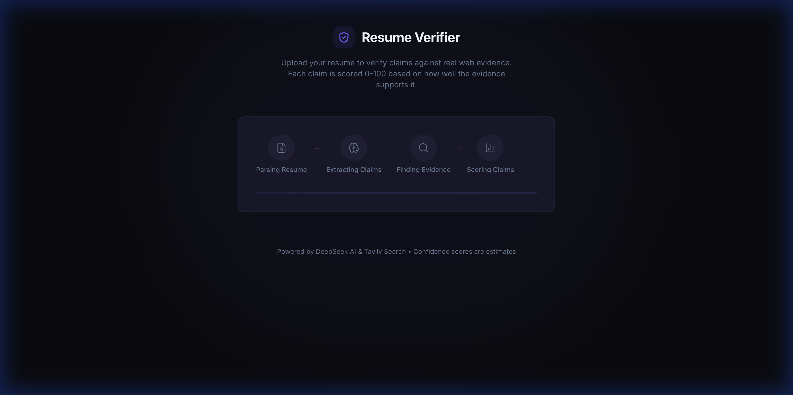

# Resume Verifier 🛡️

> **Verify resume claims with real-time web evidence and factual correlation.**

[](https://resume-verifier-production-5644.up.railway.app)
*Click the badge above to try the live hosted version on Railway.*

---

## 🚀 Overview
Resume Verifier is an AI-powered engine that extracts verifiable claims from resumes, cross-references them against real-time web data (LinkedIn, GitHub, Portfolios, News), and assigns a **Factual Correlation Score** grounded in evidence.



## ⚖️ Factual Correlation Scoring
The system uses a **Staff-Level Correlation Engine** to prevent inflated scores. It balances identity linkage with factual evidence.

### Step 1: LLM Base Score (0-70)
DeepSeek evaluates claims against snippets with strict trust tiers:
- **0**: NOISE (Irrelevant or nonsense)
- **1-25: WEAK** (Entity found, but name is missing or ambiguous)
- **26-45: PLAUSIBLE** (Name + Entity both present in professional context)
- **46-70: CONFIRMED** (Verified by 3rd-party news, govt, or registries)

### Step 2: Correlation Modifiers
- **Identity Linkage**: Mirror matches on GitHub/LinkedIn/Professional sites add a **+40 Identity Bonus**.
- **Multi-Source Boost**: +10 for 3+ independent sources.
- **Factual Correlation Guard**: If a claim is flagged as "Noise" or the `base_score` < 15, all bonuses are stripped to prevent "Identity Squatting" from inflating scores.

---

## 🏗️ Architecture & Tools

### Clean Architecture (Staff Level)
- **Separation of Concerns**: Orchestration logic is housed in `VerificationService` (`service.py`).
- **Dependency Injection**: Services receive clients via a centralized `ServiceProvider`.
- **Global-Free**: All module-level global variables have been eliminated.

### Tech Stack
| Tool | Why |
|------|-----|
| **Redis** | Multi-level caching (Verification Replay, Search hits, Scoring results) |
| **FastAPI** | Async-native pipeline with SSE streaming |
| **DeepSeek** | SOTA cost-efficiency for fact-checking prompts |
| **Tavily** | Identity-aware search depths and domain filtering |
| **Vite + React** | Instant UI responsiveness & Glassmorphic Design |

---

## ⚡ Performance Metrics

| Mode | Duration | Cost |
|------|----------|------|
| **Full Pipeline (Cold)** | ~12-18s | ~$0.05 |
| **Cache Hit (Re-upload)** | **0.05s** | **$0.00** |

---

## 🛠️ Local Development
```bash
# Backend (using uv)
cd backend && uv sync
uv run uvicorn main:app --port 8000

# Frontend (using Bun)
cd frontend && bun install
bun run dev
```

## 🏠 Hosting
Optimized for **Railway**. Use the provided `railway.json` files for 1-click deployment.
